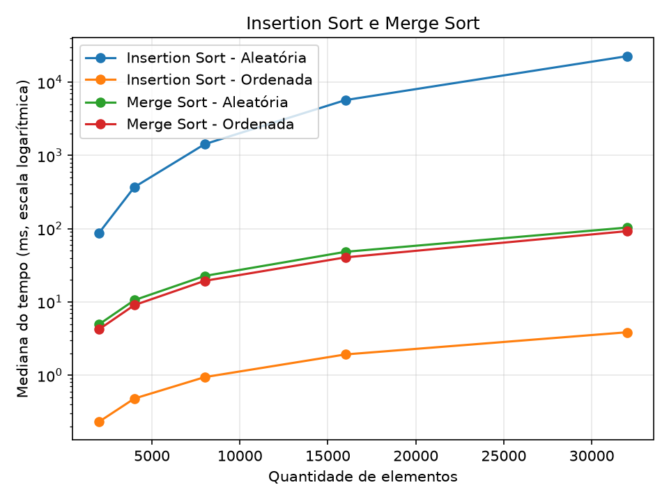

# Insertion Sort e Merge Sort

Comparamos como o tempo dos dois algoritmos cresce com entradas aleatórias e ordenadas.

## Arquivos

- `src/insertion_sort.py`: ordena inserindo cada valor na posição correta.
- `src/merge_sort.py`: divide a lista e intercala as partes ordenadas.
- `src/experimento.py`: mede os dois algoritmos e gera o CSV e o gráfico.
- [dados/tempos.csv](dados/tempos.csv): tempos medidos e razões.
- [DIARIO.md](DIARIO.md): expectativas e dificuldades.

## Como rodar

Com Python 3.10 ou superior, abra o terminal na pasta do trabalho e execute:

```sh
python -m pip install matplotlib
python src/experimento.py
```

O script mostra o andamento no terminal e salva `dados/tempos.csv` e `graficos/comparacao.png` ao terminar. Os maiores casos do Insertion Sort podem demorar alguns minutos no total. Uma nova execução substitui os resultados; a tabela deste README deve ser atualizada manualmente se os dados mudarem.

## Como medimos

Usamos 2.000, 4.000, 8.000, 16.000 e 32.000 elementos. Embaralhamos os números de 0 a n−1 com semente 42. No outro cenário, usamos esses mesmos números em ordem crescente.

Para cada algoritmo, cenário e tamanho, executamos quatro vezes: descartamos a primeira e calculamos a mediana das três restantes. Cada execução recebe uma cópia nova da entrada. A cópia e a conferência do resultado ficam fora do tempo medido.

O CSV contém os três tempos, a mediana em milissegundos e a razão entre a mediana atual e a anterior. A primeira razão fica vazia. A mediana é o valor do meio quando colocamos os três tempos em ordem. A razão é calculada dentro do mesmo algoritmo e cenário: tempo atual dividido pelo tempo do tamanho anterior.

## O que encontramos

Ao dobrar a quantidade de elementos, observamos estas razões, na ordem 2.000→4.000, 4.000→8.000, 8.000→16.000 e 16.000→32.000:

| Algoritmo | Entrada | Razões medidas | Crescimento esperado |
|---|---|---|---|
| Insertion Sort | Aleatória | 3.90, 4.11, 3.95, 4.00 | O(n²) |
| Insertion Sort | Ordenada | 2.02, 2.02, 2.03, 2.00 | O(n) |
| Merge Sort | Aleatória | 2.09, 2.26, 2.03, 2.15 | O(n log n) |
| Merge Sort | Ordenada | 2.12, 2.20, 2.12, 2.11 | O(n log n) |

O Insertion Sort aleatório desloca muitos elementos para inserir cada valor na posição certa: esperamos razão próxima de 4, característica do crescimento quadrático. Na entrada ordenada, ele não precisa deslocar valores: esperamos razão próxima de 2, característica do crescimento linear.

O Merge Sort divide a lista ao meio e intercala as partes. Ele faz isso nos dois cenários, mantendo crescimento n log n, cuja razão esperada nestes tamanhos fica um pouco acima de 2. Nesta execução, a entrada ordenada foi mais rápida para os dois algoritmos. No Merge Sort, ela pode reduzir comparações durante a intercalação, mas a divisão e a cópia dos elementos continuam necessárias. Por isso, a classe de crescimento permanece a mesma. No Insertion Sort, a entrada ordenada é o melhor caso.



O eixo do tempo usa escala logarítmica para mostrar juntos os casos rápidos e lentos. Os tempos podem variar entre execuções, especialmente nos casos mais rápidos; os números apoiam a análise, mas não provam sozinhos a complexidade.

